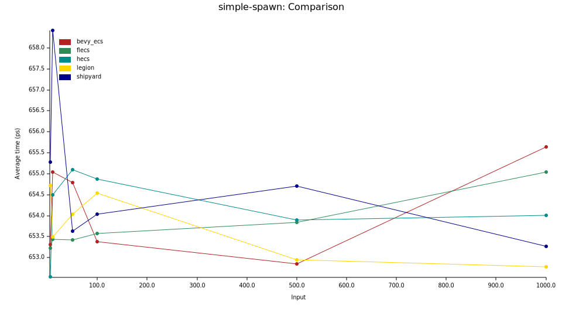
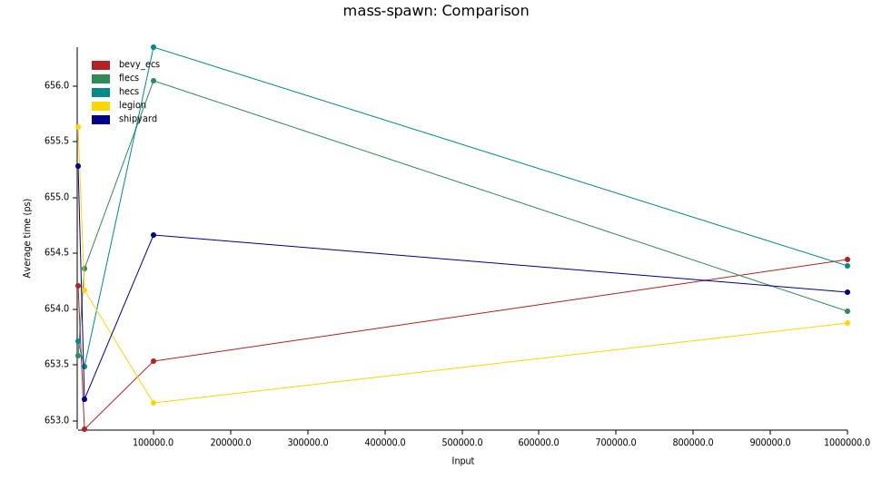
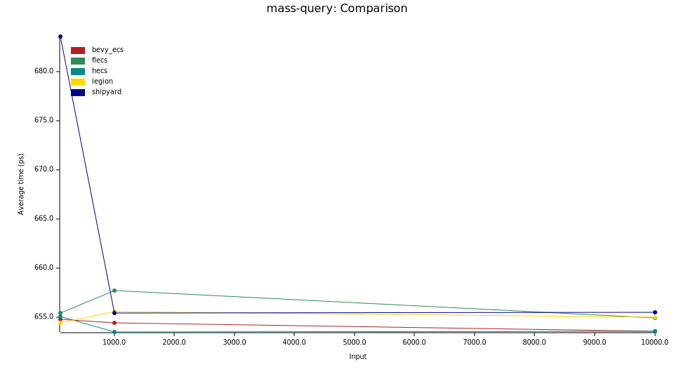

# Rusty ECS Benchmark

**A benchmark for comparing Rusty Entity-Component-Systems.**

## Benches

**Simple Spawn:** Spawns a number of entities without any components.

**Mass Spawn:** Spawns a massive amount of entities with different components A and B and despawns only entities with Component A.

**Mass Query:** Spawns a bunch of entities with a bunch of components and queries for them, updating them afterward.

## Results

**Benched on a 64-bit Windows 11 Pro Machine with 4 Intel Cores i5-6500 CPU @ 3.20GHz 3.19 GHz.**

For the whole report, look at the complete [results](results/)

### Simple Spawn

### Mass Spawn

### Mass Query

